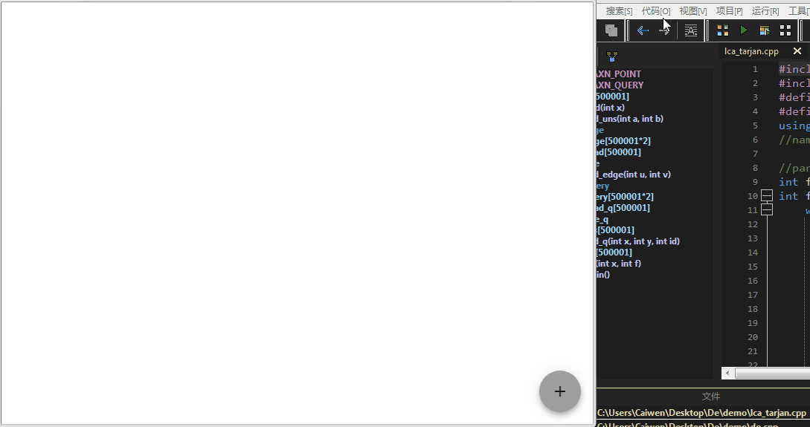
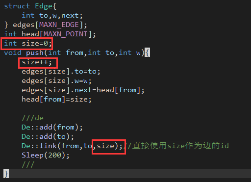

# De
A visual noip graphy theory debugger.一个可视化的信息学竞赛中图的调试工具

# 演示


洛谷p3379，使用tarjan算法求lca，将其中并查集的部分的可视化，可以看到路径压缩的过程
（参考demo）

# 使用方法
1. 下载de
[通过github下载](https://github.com/caiwen666/De/releases) 
[通过其他方式下载](https://www.gcteamo.com/de-release-1.0.zip)<br>
（程序使用electron，有点大）

2. 下载后的压缩包中de目录就是主程序，双击其中的de.exe可以启动主程序
3. 将压缩包中的ws.exe和de.cpp放入你的代码文件所在的目录，确保三者在同一文件夹下
4. 在你的代码的头文件中加入
```c
#include "de.cpp" 
```
对de.cpp进行引用

5. 在main函数的开头加入下面代码
```c
De::connect();
De::build();
```
连接到主程序并创建一个图

6. 接下来可以调用de.cpp中提供的一系列函数，进行添加点，建边等操作，主程序会显示

# 函数
下列是de.cpp中提供的所有函数

* connect();

    连接到de，在使用下面所有函数前必须先执行这个函数。如果连接成功，主程序左下角会显示“连接成功”
* setVec(bool x);

	是否是有向图，x为true则为有向图，为false则为无向图，默认为有向图
* build();
	
    构建图，只有进行了这个函数之后才可以使用下面的函数。如果构建成功，主程序左下角会显示“成功构建图”
* add(int id);
	
    新建一个id为id的点，在主程序中点旁边的序号就是id
* link(int from,int to,int id);
	
    新建一个从点from到点to的一条边，id为边的id<br>
	from，to为点的id<br>
	边的id需要自己分配，详情参考“边的id”
* init(string type);
	
    以type的布局来重新布局<br>
	注意，你一开始所加的点，所建的边都不会显示在主程序中（都挤在左上角了）<br>
	需要执行init(type)后才会正常显示图<br>
	其中的type值请参考[cytoscape.js文档](https://js.cytoscape.org/#layouts)<br>
	这里有两个比较常用的值可以参考<br>
	"breadthfirst"：类似于树形的布局<br>
	"grid"：类似于网格的布局<br>
	另外，当你对图进行比较大的改动，此时需要再次执行init(type)来重新布局
* light(int id,bool point);
	
    将指定的边或点进行高亮（相当于带上颜色）<br>
	point为true，则将id为id的点高亮<br>
	point为false，则将id为id的边高亮
* light(int id,bool point);
	
    取消高亮，参考light(id,point)
* remove(int id,bool point);
	
    将指定的边或点删除
	id和point的说明参考light(id,point)

# demo
demo文件夹中提供了两个例子，一个是最开始演示的程序，另一个是spfa的（效果不太好），可以参考<br>
其中有关de的代码已经用注释标出

# 其他
主程序的右下角有个加号<br>
其中“垃圾桶”图标为删除图，会将所有点的边删除，建议每次调试时点一下这个<br>
其中“刷新“图标为重放，会将刚才你写的代码所进行的所有操作按照1s一个的速度按顺序重新展示（相当于重新播放）

# 补充
* 边的id

    这里提供两个分配的方式进行参考<br>
    如果使用邻接表进行建图，可以直接借用edge数组下标，如图<br>
    
    (demo中的spfa采用这种方式)<br>
    对于其他建图方式，比如有一个从id为a的点指向id为b的点的线段的线段id可以表示为a*10+b<br>
    (demo中的lca_tarjan采用这种方式)<br>
    你还可以自行选择其他的分配方式
* 端口占用
    
    由于de使用websocket与被调试程序进行连接，所以可能会出现端口被占用的情况。这时候可以更改de目录下的config.json，将其中的15567改为其他端口号，并将de.cpp中“ws.exe 15567”处中的15567也改过来

# 最后
这个是自己闲的无聊随便写的小程序，制作的较为粗糙，不喜勿喷，有时间会加更多的功能。
用到了下面的项目，非常感谢他们

* cytoscape.js
* jquery.js
* node.js
* electron
* mdui

有问题和建议可以联系作者<br>
QQ:3102733279<br>
邮箱:3102733279@qq.com<br>
(github的issue不怎么看)<br>
